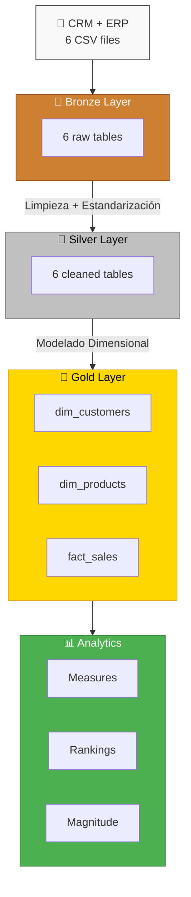
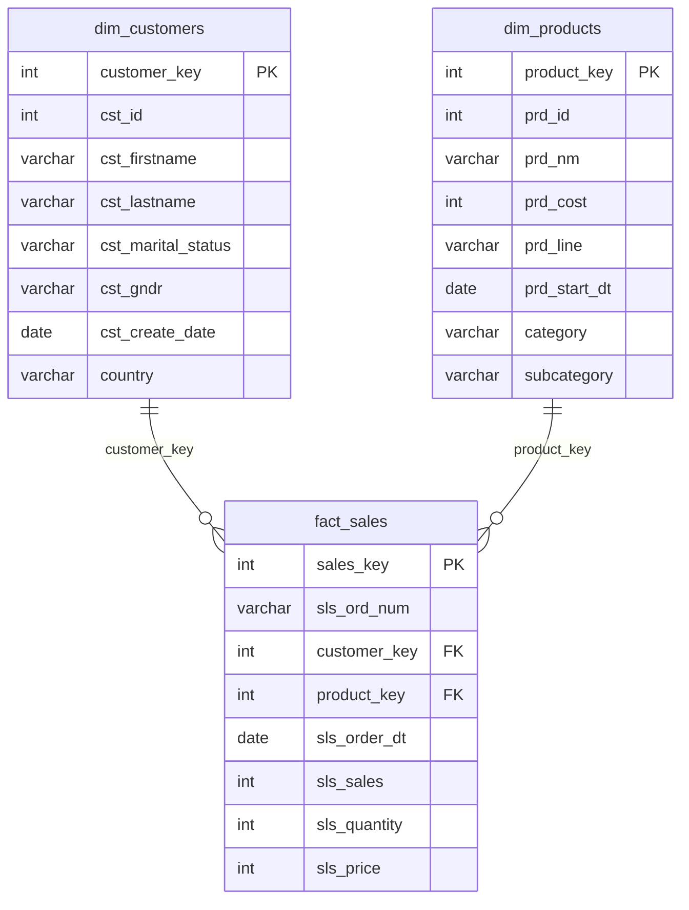

# 🏗️ SQL Data Warehouse — Curso SQL Avanzado


> Proyecto completo de data warehouse implementando la arquitectura **Medallion** (Bronze → Silver → Gold) con **PostgreSQL**, incluyendo 22 scripts SQL de conceptos avanzados y un pipeline ETL que integra datos de fuentes CRM y ERP.

---

## 📖 Sobre este proyecto

Implementación práctica de un curso de SQL avanzado orientado a ingeniería de datos. El repo contiene 22 scripts independientes que cubren desde joins básicos hasta window functions y optimización de rendimiento, además de un proyecto completo de data warehouse que integra datos de dos fuentes CRM y ERP a través de las capas Bronze, Silver y Gold.

---

## 🏛️ Arquitectura Medallion



| Capa | Objetos | Descripción |
|------|---------|-------------|
| 🥉 **Bronze** | 6 tablas | Ingesta raw de CSVs sin transformación |
| 🥈 **Silver** | 6 tablas | Limpieza, deduplicación, normalización, tipado |
| 🥇 **Gold** | 3 vistas | Modelo dimensional (dim_customers, dim_products, fact_sales) |
| 📊 **Analytics** | 6 consultas | Medidas, rankings, dimensiones, análisis de magnitud |

---

## 📚 Temas cubiertos

### Joins y relaciones entre tablas
- INNER, LEFT, RIGHT, FULL y CROSS JOIN
- Anti Joins (LEFT/RIGHT/FULL ANTI JOIN) para detección de registros no coincidentes
- Joins multi-tabla (3+ tablas)

### CTEs y Subqueries
- CTEs standalone, anidadas y recursivas (generación de números, jerarquías de empleados)
- Subqueries en FROM, SELECT, JOIN y WHERE
- Subqueries correlacionadas y operadores ANY/ALL
- Tablas temporales (CREATE TEMP TABLE, SELECT INTO)

### Window Functions
- Ranking: ROW_NUMBER, RANK, DENSE_RANK, NTILE, CUME_DIST, PERCENT_RANK
- Agregados: SUM, AVG, COUNT, MIN, MAX OVER() con PARTITION BY
- Value: LAG, LEAD, FIRST_VALUE, LAST_VALUE con ROWS BETWEEN
- Totales acumulados, promedios móviles y cálculo de porcentajes

### Funciones y transformaciones
- Fechas: EXTRACT, TO_CHAR, DATE_TRUNC, INTERVAL arithmetic
- Strings: CONCAT, UPPER, LOWER, TRIM, LENGTH, LEFT, RIGHT, SUBSTRING
- NULLs: COALESCE, NULLIF, manejo de nulos en joins y agregaciones
- Condicional: CASE (simple y searched), agregación condicional
- Set Operators: UNION, UNION ALL, EXCEPT, INTERSECT

### Optimización y rendimiento
- Índices (B-tree, Columnstore, Filtered, Unique) y catálogos del sistema (pg_class, pg_index)
- EXPLAIN ANALYZE y planes de ejecución (Nested Loops, Hash Join, Merge Join)
- 29 tips de performance: selección de columnas, filtrado previo al join, agregación previa, particionamiento
- VACUUM, ANALYZE, gestión de estadísticas

### DDL y arquitectura de datos
- CREATE TABLE, PRIMARY KEY, FOREIGN KEY, SERIAL, DEFAULT
- Vistas (CREATE OR REPLACE VIEW, vistas anidadas con CTEs)
- Particionamiento por rango (RANGE PARTITION)
- Stored Procedures con PL/pgSQL (manejo de errores, variables, COPY FROM)

### ETL y Data Warehouse
- Arquitectura Medallion (Bronze → Silver → Gold)
- Ingesta masiva de CSV con COPY FROM
- Limpieza de datos: deduplicación (ROW_NUMBER), normalización (UPPER, TRIM), estandarización (CASE)
- Modelo dimensional: dim_customers, dim_products, fact_sales con surrogate keys
- Validación de integridad referencial y reglas de negocio

---

## 🚀 Proyectos

### 🏗️ Data Warehouse (Bronze → Silver → Gold)

Proyecto completo de data warehouse que integra datos de dos sistemas fuente (CRM y ERP) con ~18,500 clientes, ~400 productos y ~60,000 transacciones de venta. Implementa la arquitectura Medallion con stored procedures para la carga automatizada en cada capa.

- **Bronze:** Ingesta raw de 6 CSVs con COPY FROM y manejo de errores transaccionales
- **Silver:** Limpieza con deduplicación, normalización de strings, parsing de IDs, validación de fechas y reglas de negocio (ventas = cantidad × precio)
- **Gold:** Modelo dimensional con dim_customers, dim_products y fact_sales, incluyendo surrogate keys generadas con ROW_NUMBER

### 📊 Star Schema — Modelo Dimensional



### 📈 Data Analytics

Conjunto de consultas de análisis exploratorio sobre el data warehouse resultante: medidas (SUM, AVG, COUNT), dimensiones (país, género, categoría), análisis de magnitud, ranking de productos con TOP-N por ventas, y exploración de rangos de fechas. Usa window functions (RANK, ROW_NUMBER) y agregaciones multi-tabla para generar insights accionables.

---

## 🛠️ Stack


| Componente | Tecnología |
|------------|------------|
| **Motor de base de datos** | PostgreSQL |
| **Lenguaje** | SQL (PL/pgSQL para stored procedures) |
| **Herramientas de carga** | COPY FROM (ingesta CSV), TRUNCATE + INSERT (patrón ETL) |
| **Sistemas de datos simulados** | CRM + ERP |

---

## 📁 Estructura del repositorio

```
Curso-SQL-Avanzado/
├── scripts/                          Scripts SQL independientes por concepto
│   ├── joins-basics.sql              JOINs básicos (INNER, LEFT, RIGHT, FULL)
│   ├── joins.avanced.sql             Anti Joins, CROSS JOIN, joins multi-tabla
│   ├── CTE.sql                       CTEs standalone, anidadas y recursivas
│   ├── Subqueries.sql                Subqueries en múltiples cláusulas
│   ├── CTA_and_Temp_Tables.sql       CTAS, tablas temporales, transacciones
│   ├── WindowBasics.sql              Fundamentos de window functions
│   ├── WindowRanking.sql             ROW_NUMBER, RANK, DENSE_RANK, NTILE
│   ├── WindowsAggregate.sql          Agregados con OVER(), promedios móviles
│   ├── WindowsValue.sql              LAG, LEAD, FIRST_VALUE, LAST_VALUE
│   ├── aggregateFunctions.sql        COUNT, SUM, AVG, MAX, MIN, GROUP BY
│   ├── case.statement.sql            Expresiones CASE y agregación condicional
│   ├── string-functions.sql          CONCAT, UPPER, TRIM, SUBSTRING, etc.
│   ├── null-functions.sql            COALESCE, NULLIF, manejo de nulos
│   ├── numeric-functions.sql         EXTRACT, DATE_TRUNC, INTERVAL
│   ├── format-functions.sql          TO_CHAR, CAST, formateo de fechas
│   ├── set-operators.sql             UNION, EXCEPT, INTERSECT
│   ├── views.sql                     CREATE VIEW con CTEs y joins
│   ├── index.sql                     Índices, EXPLAIN ANALYZE, pg catalogs
│   ├── performance_tips.sql          29 tips de optimización de queries
│   ├── partitions.sql                Particionamiento por rango
│   ├── task.sql                      Ejercicio integrador (DDL + CTE + window)
│   └── AI_And_SQL.sql                Consultas asistidas por IA
├── projects/Data_with_baraa/         Proyecto de data warehouse y analytics
│   ├── DWH/                          Data warehouse con arquitectura Medallion
│   │   ├── bronze/                   Ingesta raw (Create_DWH, Create_Tables, Insert_Data)
│   │   ├── silver/                   Limpieza y transformación (DDL, cleaning, load, analyze)
│   │   ├── gold/                     Modelo dimensional (vistas dim_*, fact_*)
│   │   ├── maintenance/              Stored procedures para carga automatizada
│   │   └── datasets/                 Datos fuente CSV (~116K filas)
│   │       ├── source_crm/           cust_info, prd_info, sales_details
│   │       └── source_erp/           CUST_AZ12, LOC_A101, PX_CAT_G1V2
│   └── Data_Analytics/               Consultas de análisis exploratorio
│       ├── database_exploration.sql  Metadatos del catálogo (information_schema)
│       ├── date_exploration.sql      Rangos de fechas y antigüedad
│       ├── dimensions_exploration.sql Distinct values por dimensión
│       ├── measures_exploration.sql  Métricas agregadas (SUM, AVG, COUNT)
│       ├── magnitude.sql             Análisis de magnitud por dimensión
│       └── ranking_analyze.sql       Ranking de productos con window functions
```

---

## ▶️ Cómo ejecutar

1. Crear una base de datos PostgreSQL
2. Ejecutar `projects/Data_with_baraa/DWH/bronze/Create_DWH.sql` para crear el esquema
3. Ejecutar `projects/Data_with_baraa/DWH/bronze/Create_Tables.sql` para crear las tablas
4. Ejecutar `projects/Data_with_baraa/DWH/bronze/Insert_Data.sql` para cargar los datos CSV
5. Ejecutar los scripts de `silver/` para limpiar y transformar
6. Ejecutar `gold/gold.sql` para crear las vistas dimensionales
7. Los scripts de `scripts/` son independientes y se pueden ejecutar en cualquier momento

> **Nota:** Los datasets CSV deben estar en la ruta `projects/Data_with_baraa/DWH/datasets/` para que el COPY FROM funcione correctamente.
